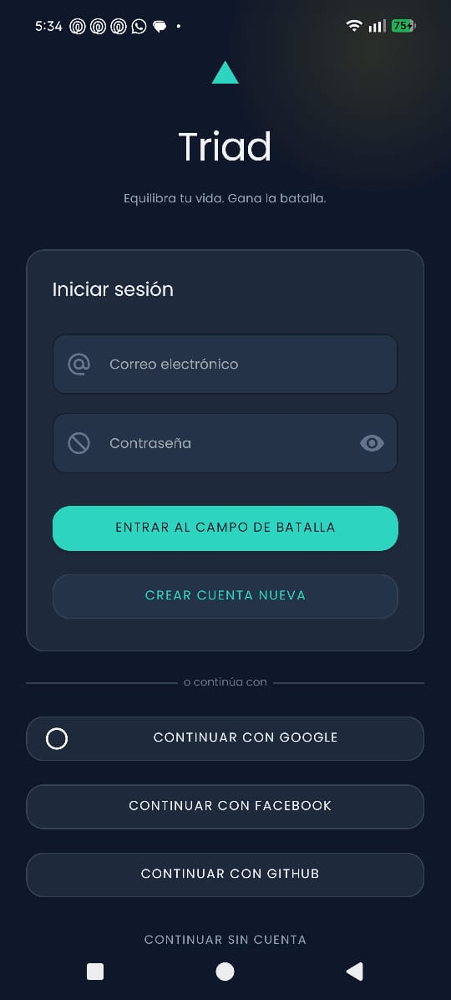
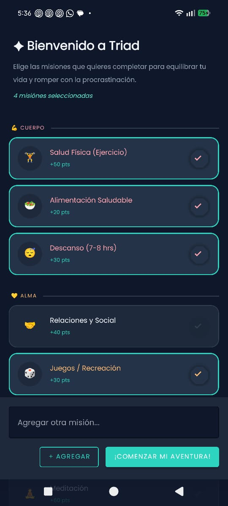
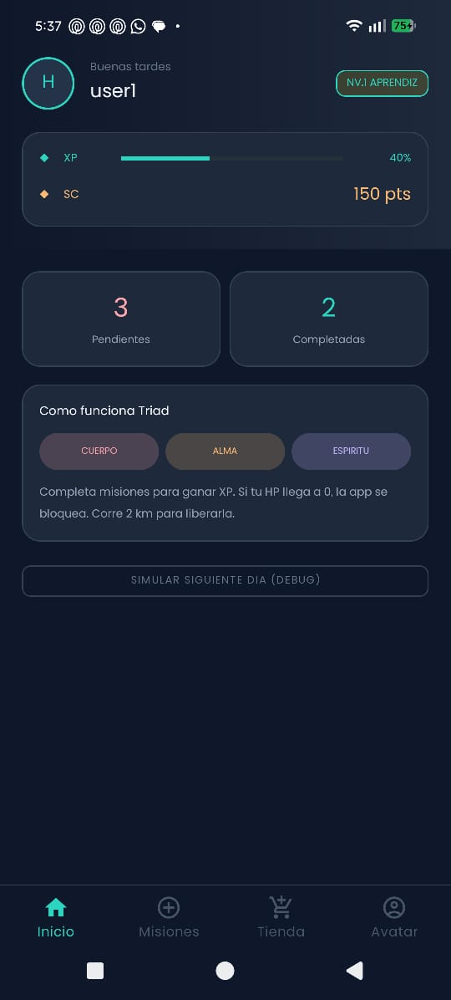
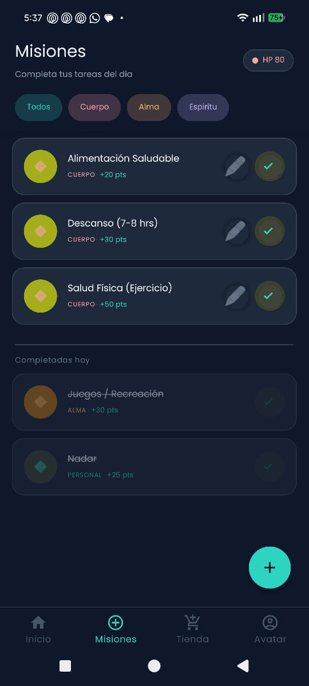
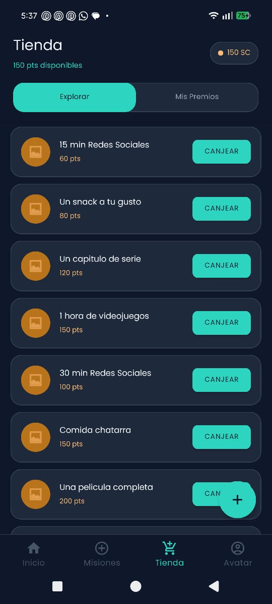
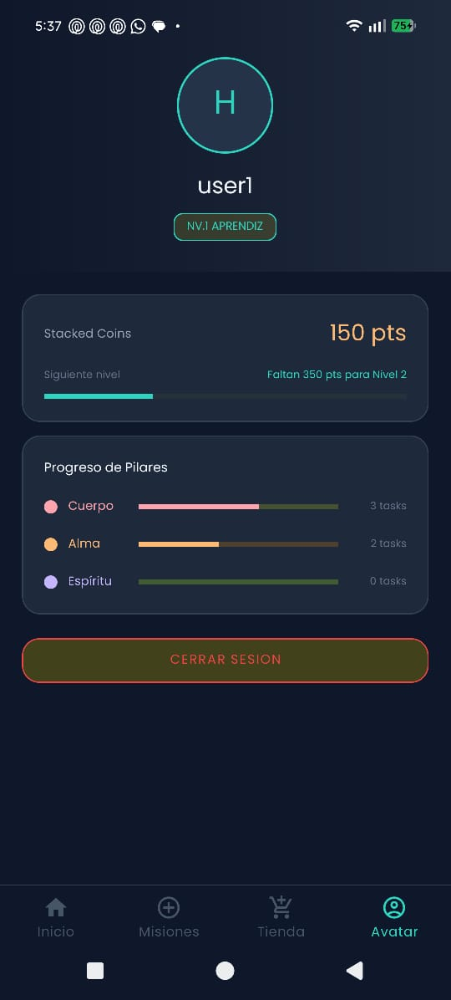
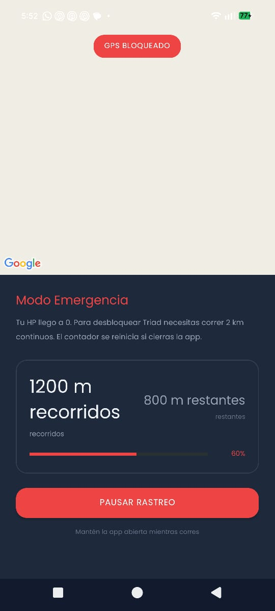

# ✦ Triad — Equilibra tu vida

> **Gamifica tus hábitos. Rompe con la procrastinación. Vive en balance.**

Triad es una aplicación Android que convierte tus rutinas diarias en misiones. Gana puntos completando tareas, sube de nivel y canjea recompensas. Si fallas tus misiones, pierdes puntos — y si llegas a cero, la app se bloquea hasta que corras 2 kilómetros continuos para desbloquearla.

---

## Screenshots

<div align="center">

| Login | Onboarding | Dashboard |
|:---:|:---:|:---:|
|  |  |  |

| Misiones | Tienda | Avatar |
|:---:|:---:|:---:|
|  |  |  |

| Bloqueo GPS |
|:---:|:---:|
|  |

</div>


---

## Concepto del juego

Tu vida se divide en tres pilares — **Cuerpo**, **Alma** y **Espíritu** — más una categoría de **Deberes** cotidianos. Cada día tienes misiones que completar en cada área. El sistema funciona así:

- **Completas una misión** → ganas puntos y subes de nivel
- **No completas una misión** → al día siguiente se aplica una penalización de puntos
- **Llegas a 0 puntos** → la app se bloquea
- **Para desbloquear** → debes correr 2km continuos con GPS verificado

---

## Funcionalidades

### Autenticación
- Login con **email y contraseña**
- Login con **Google**, **Facebook** y **GitHub**
- Modo **invitado** (anónimo)
- **Auto-login biométrico** (huella / Face ID) con persistencia segura

### Onboarding
- Pantalla de bienvenida con selección de hábitos predefinidos por categoría
- Opción de agregar misiones personalizadas
- Se muestra **solo la primera vez** — controlado con `onboardingCompleto` en Firestore

### Sistema de misiones
- Tareas recurrentes que se **reinician cada día** automáticamente
- Penalizaciones aplicadas al inicio del siguiente día si no se completaron
- Creación de tareas personalizadas con categoría, puntos y recurrencia

### Progresión
- Sistema de **7 niveles**: Aprendiz → Legendario
- Barras de **HP**, **Alma** y **Espíritu**
- Progreso XP visible hacia el siguiente nivel

### Tienda de recompensas
- Canjea puntos por recompensas reales: ver una película, redes sociales, comida chatarra, etc.
- Validación de saldo antes de cada canje

### Sistema de bloqueo GPS
- Al quedarse sin puntos → `bloqueada: true` en Firestore
- La app redirige a `LockActivity` en cualquier intento de acceso
- El usuario debe correr **2km continuos** con el GPS activo
- Si cierra la app durante la carrera, el contador se reinicia (forzando continuidad real)
- Al completar 2km → se restauran 300 puntos y se desbloquea la app

### Notificaciones
- Recordatorio diario programado con **WorkManager** a las 9:00 AM
- Se cancela automáticamente al cerrar sesión

---

## Stack tecnológico

| Categoría | Tecnología |
|---|---|
| Lenguaje | Kotlin |
| UI | XML Layouts + Material Design 3 |
| Autenticación | Firebase Auth |
| Base de datos | Firebase Firestore |
| Mapas y GPS | Google Maps SDK + Fused Location Provider |
| Notificaciones | WorkManager |
| Login social | Google Sign-In, Facebook SDK, GitHub OAuth |
| Biometría | AndroidX Biometric |

---

## Arquitectura

```
app/
├── LoginActivity          # Punto de entrada, maneja todos los métodos de auth
├── WelcomeActivity        # Onboarding de primera vez
├── MainActivity           # Contenedor con BottomNavigationView
│   ├── HomeFragment       # Dashboard: puntos, progreso, reinicio diario
│   ├── TasksFragment      # Lista de misiones del día
│   ├── ShopFragment       # Tienda de recompensas
│   └── AvatarFragment     # Perfil, stats, nivel, cerrar sesión
├── CreateTaskActivity     # Crear tarea personalizada
├── DefeatActivity         # Pantalla de penalización
├── LockActivity           # Bloqueo GPS — desbloqueo con carrera
├── RunningTrackerService  # ForegroundService de rastreo GPS
├── DailyReminderWorker    # Worker de notificación diaria
└── NotificationScheduler  # Programa / cancela el worker
```

---

## Estructura de Firestore

### Colección `/users/{uid}`

```json
{
  "name": "string",
  "points": 0,
  "level": 1,
  "hp": 100,
  "happiness": 100,
  "mana": 100,
  "onboardingCompleto": false,
  "bloqueada": false,
  "metrosAcumulados": 0.0,
  "ultimoReinicio": ""
}
```

### Colección `/tasks/{taskId}`

```json
{
  "userId": "string",
  "title": "string",
  "category": "CUERPO | ALMA | ESPIRITU | DEBERES | PERSONAL",
  "points": 50,
  "penalizacion": 25,
  "recurrent": true,
  "completed": false,
  "createdAt": 1234567890
}
```

### Colección `/recompensas/{id}`

```json
{
  "titulo": "string",
  "descripcion": "string",
  "costo_puntos": 400,
  "categoria": "entretenimiento",
  "activa": true
}
```

---

## ⚙️ Instalación y configuración

### Prerrequisitos

- Android Studio Hedgehog o superior
- Android SDK 24+
- Cuenta en Firebase
- API Key de Google Maps

### Pasos

**1. Configurar Firebase**
- Crea un proyecto en [Firebase Console](https://console.firebase.google.com)
- Activa **Authentication** con los proveedores: Email/contraseña, Google, Facebook, GitHub
- Activa **Firestore Database**
- Descarga `google-services.json` y colócalo en `app/`

**2. Configurar Google Maps**
- Activa **Maps SDK for Android** en [Google Cloud Console](https://console.cloud.google.com)
- Crea una API Key y agrégala en `AndroidManifest.xml`:
```xml
<meta-data
    android:name="com.google.android.geo.API_KEY"
    android:value="TU_API_KEY_AQUI"/>
```

**3. Configurar Facebook Login**
- Crea una app en [Meta for Developers](https://developers.facebook.com)
- Agrega tu `facebook_app_id` y `facebook_client_token` en `res/values/strings.xml`

**4. Tipografía Poppins**
- Descarga desde [Google Fonts](https://fonts.google.com/specimen/Poppins)
- Coloca `poppins_regular.ttf`, `poppins_semibold.ttf` y `poppins_bold.ttf` en `res/font/`

---

## Flujo de usuario

```
Abrir app
    │
    ├── Sin sesión ──────────────────── LoginActivity
    │                                        │
    │                              ┌─────────┴──────────┐
    │                          Nuevo usuario      Ya tiene cuenta
    │                              │                    │
    │                        WelcomeActivity     decidirDestino()
    │                        (selección de            │
    │                          hábitos)        ┌──────┴──────┐
    │                              │         Bloqueado    Normal
    │                              │            │            │
    │                              └────────────┘     MainActivity
    │                                           │
    │                                     LockActivity
    │                                     (correr 2km)
    │
    └── Con sesión ───────────────── decidirDestino() → destino correcto
```
